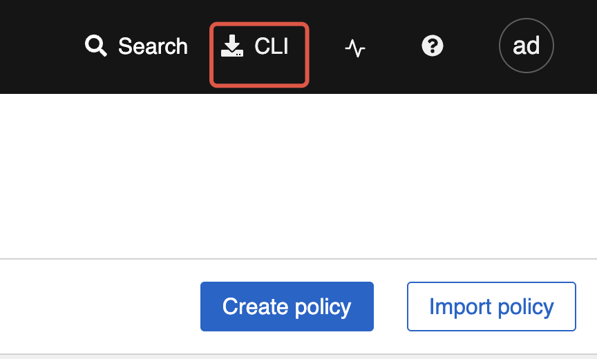

# Roxctl CLI Installation

This guide provides instructions for installing, configuring, and using the `roxctl` command-line interface (CLI) for Alauda Container Security. The CLI is available for Linux, macOS, Windows, and as a container image.

---

## Overview

- **roxctl** is a CLI tool for managing and interacting with Alauda Container Security.
- Supported platforms: **Linux**, **macOS**, **Windows**.
- After installation, verify the CLI version to ensure correct setup.

---

## Installation

### Install on Linux

> Supported architectures: `amd64`, `arm64`, `ppc64le`, `s390x`

**Steps:**

1. Determine your architecture:
    ```bash
    arch="$(uname -m | sed 's/x86_64//')"; arch="${arch:+-$arch}"
    ```
2. Download the binary form the Portal:

    

3. Make it executable:
    ```bash
    chmod +x roxctl
    ```
4. (Optional) Move to a directory in your `PATH`:
    ```bash
    echo $PATH
    # mv roxctl /usr/local/bin/
    ```

---

### Install on macOS

> Supported architectures: `amd64`, `arm64`

**Steps:**

1. Determine your architecture:
    ```bash
    arch="$(uname -m | sed 's/x86_64//')"; arch="${arch:+-$arch}"
    ```
2. Download the binary form the Portal:

    

3. Remove extended attributes:
    ```bash
    xattr -c roxctl
    ```
4. Make it executable:
    ```bash
    chmod +x roxctl
    ```
5. (Optional) Move to a directory in your `PATH`:
    ```bash
    echo $PATH
    # mv roxctl /usr/local/bin/
    ```

---

### Install on Windows

> Supported architecture: `amd64`

**Steps:**

2. Download the binary form the Portal:

    
2. (Optional) Add the directory containing `roxctl.exe` to your system `PATH`.
3. Verify the installation:
    ```bash
    roxctl.exe version
    ```

---

## Verification

After installation, verify your `roxctl` version:

```bash
roxctl version
```

---

## Configuration

### Setting Environment Variables

Before using `roxctl`, set the required environment variables:

```bash
export ROX_ENDPOINT=<central_host:port>
```

If you use an API token for authentication:

```bash
export ROX_API_TOKEN=<api_token>
```

Alternatively, you can use the `--token-file` option:

```bash
roxctl central debug dump --token-file <token_file>
```

**Note:**
- Do not use both `--password` and `--token-file` options at the same time.
- If both `ROX_API_TOKEN` and `--token-file` are set, the CLI uses the token file.
- If both `ROX_API_TOKEN` and `--password` are set, the CLI uses the password.

---

### Authentication Methods

You can authenticate using an API token, administrator password (for testing only), or via the `roxctl central login` command.

#### API Token

API tokens are recommended for production and automation scenarios. They provide specific access permissions and are valid for up to one year.

**To generate an API token:**

1. In the Alauda Container Security portal, go to **Platform Configuration > Integrations**.
2. Under **Authentication Tokens**, click **API Token**.
3. Click **Generate Token**.
4. Enter a name and select a role with the required access.
5. Click **Generate** and securely store the token.

**To use the token:**

```bash
export ROX_API_TOKEN=<api_token>
```
---

## Using the roxctl CLI

### Check Authentication and User Info

To view your current authentication status and user profile:

```bash
roxctl central whoami
```

**Example output:**

```bash
UserID:        <redacted>
User name:     <redacted>
Roles:         Admin, Analyst, Continuous Integration, etc.
Access:        rw Access, rw Administration, rw Alert, ...
```

Review the output to ensure your authentication and permissions are correct.
