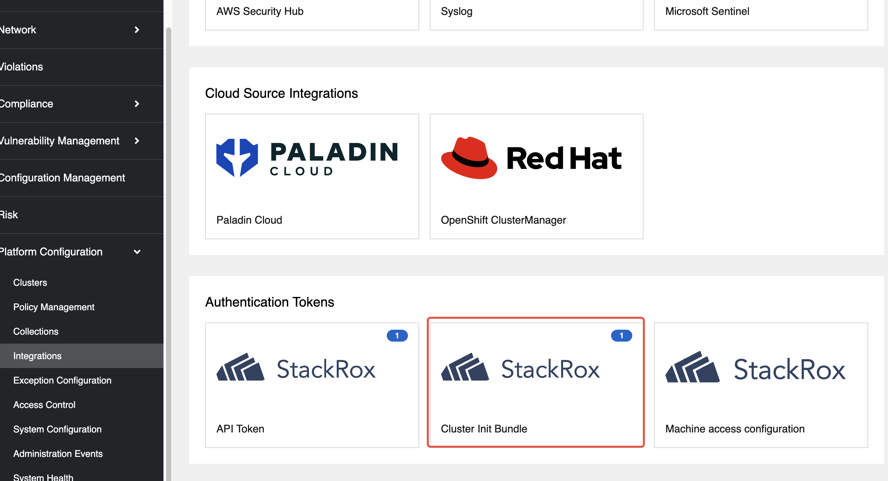
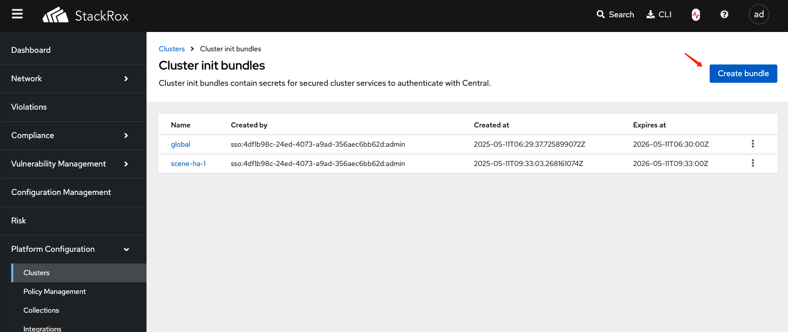
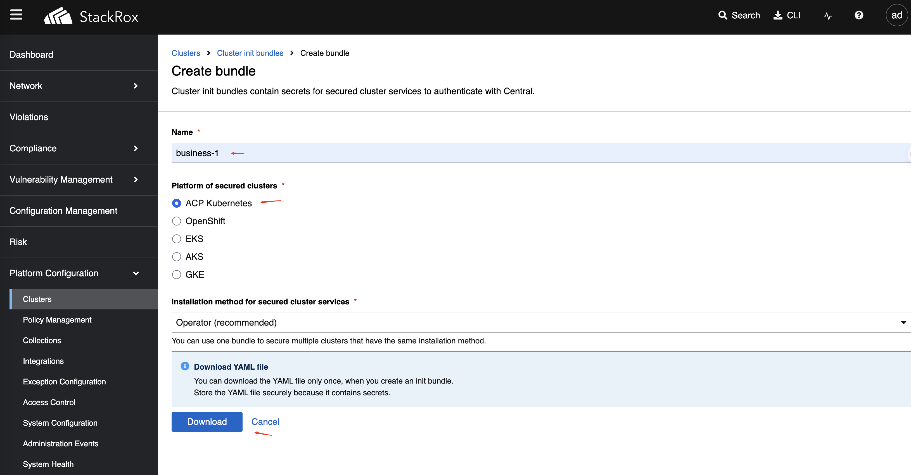

# Alauda Container Security Plugin Installation

This guide provides step-by-step instructions for installing the Alauda Container Security plugin.

## Installation Requirements

- Architecture: `amd64`
- Kernel version: `>=5.8`
- Resource requirements:
  - CPU: `>=4`
  - Memory: `>=8GB`
- PostgreSQL: `>=13`
- TLS Certificate

## Central Service Plugin Installation

### Pre-installation Steps

1. Create the stackrox namespace:

   ```bash
   kubectl create ns stackrox
   ```

2. Create the central-db-password secret:  
   Store the password in the `password` data item.

   ```bash
   kubectl create secret generic central-db-password \
     --from-literal=password=<central db password> \
     -n stackrox
   ```

3. Enable Ingress and configure domain certificate:  
   Create a TLS secret with your certificate and key.

   ```bash
   kubectl create secret tls central-ingress-tls \
     --cert=<path/to/tls.crt> \
     --key=<path/to/tls.key> \
     -n stackrox
   ```

4. Create additional CA secret :

   ```bash
   kubectl create secret generic additional-ca \
     --from-file=00-ingress-ca.crt=<path-to-cert-file> \
     -n stackrox
   ```

---

### Install via UI

1. In Platform Management, go to **Marketplace → Cluster Plugins**.
2. Click the **Install** button next to the Central Service for StackRox plugin.
3. Fill in the storage class and configuration parameters as prompted.  

|Parameters|Description|
|---|---|
|Central Database Connection String|The connection string for the central database.For example: `host=acid-business-1.proj01-postgres.svc port=5432 user=postgres sslmode=require`|
|Host|Specify a custom hostname for the central ingress. Specify a "central-ingress-tls" ts type secret in stackrox namespace that contains tls.crt, tls.key.|

---

### Install via YAML

Apply the following YAML to your target cluster:

```yaml
# YAML Deployment Method for StackRox Cluster Plugin
# Create a StackRox Central Services plugin instance
---
apiVersion: cluster.alauda.io/v1alpha1
kind: ClusterPluginInstance
metadata:
  annotations:
    cpaas.io/display-name: stackrox-central-services
  labels:
    create-by: cluster-transformer
    manage-delete-by: cluster-transformer
    manage-update-by: cluster-transformer
  name: stackrox-central-services
spec:
  pluginName: stackrox-central-services
  config:
    env:
      offlineMode: true     # Whether to run StackRox in offline mode.
    central:
      db:
        source:                    
          connectionString: "host=acid-business-1.proj01-postgres.svc port=5432 user=postgres sslmode=require" # Specify the database connection string
      exposure:
        ingress:
          enabled: true
          host: "example.com"
        loadBalancer:
          enabled: false
```

---

### Access Central Console

- **Address:** `https://example.com` (The address of the central ingress host)
- **Initial account:** `admin/07Apples@`

---

## Cluster Service Plugin Installation

### Generate Cluster Access Certificate

1. In Platform Configuration, go to **Platform Configuration → Integrations**.

2. Click the button of **Authentication Tokens --> Cluster Init Bundle**
   
     

3. Click **Create bundle**.  
   
   
4. Enter the name of the access cluster and download the generated file (e.g., `business-1-Operator-secrets-cluster-init-bundle.yaml`).  
   
   

---

### Cluster Pre-installation Steps

1. **Create the stackrox namespace:**

   ```bash
   kubectl create ns stackrox
   ```

2. **Apply the cluster init bundle secret:**

   ```bash
   kubectl apply -f business-1-Operator-secrets-cluster-init-bundle.yaml -n stackrox
   ```

3.If the central domain uses an untrusted certificate, you need to create the additional-ca-sensor secret. 
**Configure Ingress domain certificate :**

   ```bash
   kubectl create secret generic additional-ca-sensor \
     --from-file=00-ingress-ca.crt=<path-to-cert-file> \
     -n stackrox
   ```

---

### Cluster Install via UI

1. In Platform Management, go to **Marketplace → Cluster Plugins**.
2. Click the **Install** button next to the Cluster Service for StackRox plugin.
3. Fill in the storage class and configuration parameters as prompted.  

> **Note:** The Central service address is the access address, e.g., `wss://example.com:443`.

---

### Cluster Install via YAML

Apply the following YAML to your target cluster:

```yaml
apiVersion: cluster.alauda.io/v1alpha1
kind: ClusterPluginInstance
metadata:
  annotations:
    cpaas.io/display-name: stackrox-secured-cluster-services
  labels:
    create-by: cluster-transformer
    manage-delete-by: cluster-transformer
    manage-update-by: cluster-transformer
  name: stackrox-secured-cluster-services
spec:
  pluginName: stackrox-secured-cluster-services
  config:
    centralEndpoint: "wss://example.com:443" # Specify the address of StackRox Central Services
```

---

## Plugin Uninstallation

After uninstalling the plugin, manually clean up the following secret resources in the `stackrox` namespace if they remain:

| Secret Name Pattern         | Description                |
|----------------------------|----------------------------|
| central-*                  | Central related secrets    |
| scanner-*                  | Scanner related secrets    |
| sensor-tls                 | Sensor TLS secret          |
| service-ca                 | Service CA secret          |
| admission-control-tls      | Admission control TLS      |
| collector-tls              | Collector TLS secret       |
| stackrox-generated-once    | One-time generated secret  |

