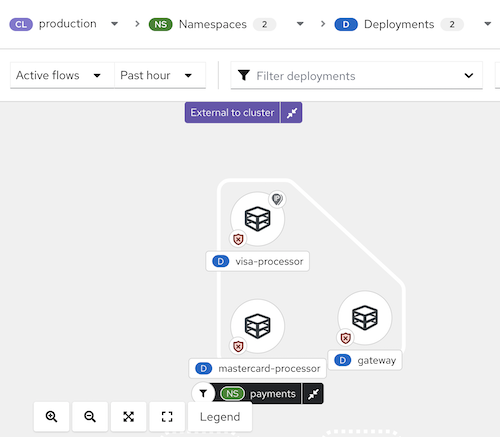
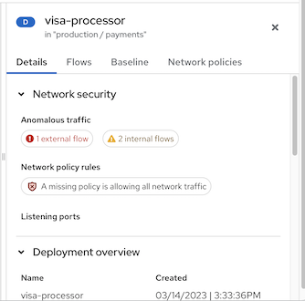
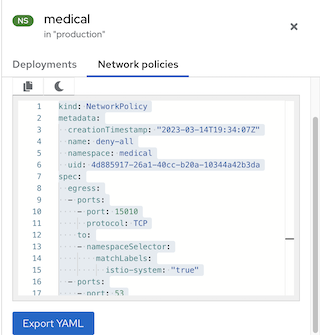

# Network Graph

The network graph in Alauda Container Security offers both high-level and detailed insights into deployments, network flows, and network policies within your environment. It helps you visualize how workloads communicate, monitor real-time and potential network traffic, and manage network security policies efficiently.

Alauda Container Security analyzes all network policies in each secured cluster, showing which deployments can communicate with each other and which can access external networks. It also tracks running deployments and their network traffic. The network graph displays the following core elements:

## Entities in the Network Graph

### Internal Entities

Internal entities represent connections between a deployment and an IP address within the private address space as defined in [RFC 1918](https://datatracker.ietf.org/doc/html/rfc1918). For more details, see "Connections involving internal entities".

### External Entities

External entities represent connections between a deployment and an IP address outside the private address space as defined in [RFC 1918](https://datatracker.ietf.org/doc/html/rfc1918). For more details, see "External entities and connections in the network graph".

## Network Components

You can use the top menu to select namespaces (**NS** label) and deployments (**D** label) to display on the graph for a chosen cluster (**CL** label). Deployments can be further filtered by CVEs, labels, or images using the drop-down list.

## Network Flows

The network graph supports two types of flow visualization:

- **Active traffic**: Displays observed, real-time traffic for the selected namespace or deployment. You can adjust the time period for the data shown.
- **Inactive flows**: Shows potential flows allowed by your network policies, helping you identify where additional policies may be needed for tighter isolation.

## Network Policies

You can view existing policies for a selected component or identify components without policies. The network graph also allows you to simulate network policies. For more information, see "Simulating network policies from the network graph".

You can interact with the network graph to view more details about items and perform actions such as adding a network flow to your baseline.

**Figure 1 Network graph example**

## Tips for Using the Network Graph

- Open the legend to learn about the symbols used for namespaces, deployments, and connections.
- Use the display options drop-down to show or hide icons such as the network policy status badge, active external traffic badge, and port/protocol labels for edge connections.
- Alauda Container Security detects changes in network traffic, such as nodes joining or leaving. When changes are detected, a notification appears showing the number of updates available. Click the notification to refresh the graph.

When you click an item in the graph, a side panel with collapsible sections presents detailed information about that item. You can select:

- Deployments
- Namespaces
- External entities
- CIDR blocks
- External groups

The side panel displays relevant information based on your selection. The **D** or **NS** label next to the item name (e.g., "visa-processor") indicates whether it is a deployment or a namespace. Below is an example of the side panel for a deployment:

**Figure 2 Side panel for a deployment example**

When viewing a namespace, the side panel includes a search bar and a list of deployments. You can click a deployment to view its information. The side panel also includes a **Network policies** tab, from which you can view, copy, or export any network policy defined in that namespace.

**Figure 3 Side panel for a namespace example**

## External Connections and CIDR Blocks

The network graph also visualizes connections between managed clusters and external sources. Alauda Container Security automatically discovers and highlights public Classless Inter-Domain Routing (CIDR) address blocks, such as Google Cloud, AWS, Microsoft Azure, Oracle Cloud, and Cloudflare. This helps you identify deployments with active external connections and determine if they are making or receiving unauthorized connections from outside your network.

By default, external connections point to a common **External Entities** icon and different CIDR address blocks. You can hide auto-discovered CIDR blocks by clicking **Manage CIDR blocks** and deselecting **Auto-discovered CIDR blocks**.

Alauda Container Security includes and regularly updates IP ranges for the following cloud providers:

- Google Cloud
- AWS
- Microsoft Azure
- Oracle Cloud
- Cloudflare

Cloud provider IP ranges are updated every 7 days, and CIDR blocks are updated daily. If you are using offline mode, you can update these ranges by installing new support packages.

The network graph is especially useful for identifying deployments with active connections to entities that do not belong to any known deployment or CIDR block. Some of these connections never leave the cluster and are made within the cluster's private network, represented as connections to or from _internal entities_.

Connections with internal entities are those between a deployment and an IP address within the private address space as defined in [RFC 1918](http://datatracker.ietf.org/doc/html/rfc1918). If the Sensor cannot identify one or both deployments involved, the system analyzes the IP address to determine if the connection is internal or external.

### Scenarios for Internal Entities

Common scenarios for internal entity connections include:

- A change of IP address or deletion of a deployment accepting connections (the server) while the client still attempts to reach it
- A deployment communicating with the orchestrator API
- A deployment communicating using a networking CNI plugin (e.g., Calico)
- A restart of the Sensor, resulting in a reset of the mapping of IP addresses to past deployments (e.g., when the Sensor does not recognize the IP addresses of past entities or past IP addresses of existing entities)
- A connection involving an entity not managed by the orchestrator (sometimes seen as _outside the cluster_) but using an IP address from the private address space as defined in RFC 1918

Internal entities are indicated with an icon. Clicking on **Internal entities** shows the flows for these entities.

## Viewing Deployment Details in a Namespace

To view details for deployments in a namespace:

1. In the Alauda Container Security portal, go to **Network Graph** and select your cluster from the drop-down list.
2. Click the **Namespaces** list and use the search field to locate a namespace, or select individual namespaces.
3. Click the **Deployments** list and use the search field to locate a deployment, or select individual deployments to display in the network graph.
4. In the network graph, click on a deployment to view the information panel.
5. Click the **Details**, **Flows**, **Baseline**, or **Network policies** tab to view the corresponding information.

Kubernetes `NetworkPolicy` resources use labels to select pods and define rules specifying what traffic is allowed to or from the selected pods. Alauda Container Security discovers and displays network policy information for all your Kubernetes clusters, namespaces, deployments, and pods in the network graph.

## Viewing Network Policies

To view network policies:

1. In the Alauda Container Security portal, go to **Network Graph** and select your cluster from the drop-down list.
2. Click the **Namespaces** list and select individual namespaces, or use the search field to locate a namespace.
3. Click the **Deployments** list and select individual deployments, or use the search field to locate a deployment.
4. In the network graph, click on a deployment to view the information panel.
5. In the **Details** tab, under **Network security**, you can view summary messages about network policy rules, including:
    - Whether policies exist in the network that regulate ingress or egress traffic
    - Whether your network is missing policies and is therefore allowing all ingress or egress traffic
6. To view the YAML file for the network policies, click on the policy rule or the **Network policies** tab.

## Managing CIDR Blocks

You can specify custom CIDR blocks or configure the display of auto-discovered CIDR blocks in the network graph.

To manage CIDR blocks:

1. In the Alauda Container Security portal, go to **Network Graph**, then select **Manage CIDR Blocks**.
2. You can:
    - Toggle **Auto-discovered CIDR blocks** to hide auto-discovered CIDR blocks in the network graph.
      > **Note:** Hiding auto-discovered CIDR blocks applies to all clusters, not just the selected cluster in the network graph.
    - Add a custom CIDR block:
        1. Enter the CIDR name and CIDR address in the fields. To add more, click **Add CIDR block** and enter information for each block.
        2. Click **Update Configuration** to save the changes.