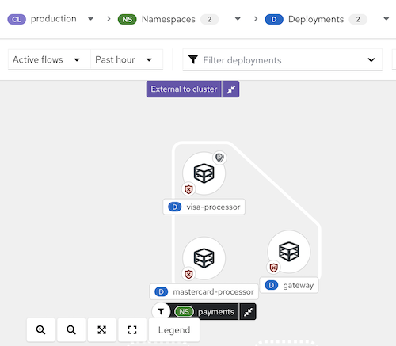
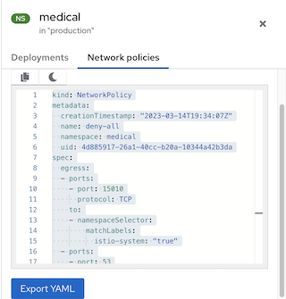

# Network Graph

The Network Graph in Alauda Security Service provides both high-level and detailed visibility into deployments, network flows, and network policies in your environment. Use it to understand workload communication, inspect observed and potential traffic, and evaluate network policy coverage.

Alauda Security Service analyzes network policies in each secured cluster, shows which deployments can communicate with each other, and highlights access to external networks. It also tracks running deployments and their traffic patterns.

## Entities in the Network Graph

### Internal Entities

Internal entities represent connections between a deployment and an IP address within the private address space as defined in [RFC 1918](https://datatracker.ietf.org/doc/html/rfc1918). For more details, see "Connections involving internal entities".

### External Entities

External entities represent connections between a deployment and an IP address outside the private address space as defined in [RFC 1918](https://datatracker.ietf.org/doc/html/rfc1918). For more details, see "External entities and connections in the network graph".

## Network Components

In the current UI, the top controls are:

- **CL** for cluster scope
- **NS** for namespace scope
- **D** for deployment scope
- **Manage CIDR blocks**
- **Network policy generator**
- **Active flows**
- **Past hour**
- **Display options**
- **Legend**

Select a cluster first, then narrow the view by namespaces and deployments. If no namespace is selected, the page can remain in the **Nothing to render yet** state until you choose at least one namespace. After a namespace is selected, the graph renders the visible namespace and deployment nodes and enables deployment filtering through the **Filter deployments** field.

> **Important:**
> The current UI warns that this version is not compatible with `AdminNetworkPolicy (ANP)`, `BaselineAdminNetworkPolicy (BANP)`, or CNI-specific network resources. If those resources are present, isolation labels and generated network policies might be misrepresented.

## Network Flows

The network graph supports two types of flow visualization:

- **Active traffic**: Displays observed, real-time traffic for the selected namespace or deployment. You can adjust the time period for the data shown.
- **Inactive flows**: Shows potential flows allowed by your network policies, helping you identify where additional policies may be needed for tighter isolation.

In the current graph view, selecting a namespace such as `cert-manager` renders the namespace node together with related deployments and internal entities in the selected time window.

## Network Policies

You can view existing policies for a selected component or identify components without policies. The Network Graph also supports policy generation and simulation workflows through **Network policy generator**.

You can interact with the network graph to view more details about items and perform actions such as adding a network flow to your baseline.

**Figure 1 Network graph example**

## Tips for Using the Network Graph

- Open the legend to learn about the symbols used for namespaces, deployments, and connections.
- Use the display options control to show or hide graph annotations as needed for the current view.
- Alauda Security Service detects changes in network traffic, such as nodes joining or leaving. When changes are detected, a notification appears showing the number of updates available. Click the notification to refresh the graph.

In the current legend, the graph explains these visible categories:

- **Node types**, including **Deployment** and **External CIDR block**
- **Namespace types**, including **Filtered namespace**, **Related namespace**, and **Related namespace grouping**
- **Deployment types**, including **Filtered deployment**
- **Deployment badges**, including:
  - **Anomalous traffic detected**
  - **Connected to external entities**
  - **Isolated by network policy rules**
  - **All traffic allowed (No network policies)**
  - **Only has an ingress network policy**
  - **Only has an egress network policy**

When you click an item in the graph, a side panel with collapsible sections shows detailed information about that item. You can inspect:

- Deployments
- Namespaces
- External entities
- CIDR blocks
- External groups

The side panel displays relevant information based on your selection. The **D** or **NS** label next to the item name (e.g., "visa-processor") indicates whether it is a deployment or a namespace. Below is an example of the side panel for a deployment:

**Figure 2 Side panel for a deployment example**

When viewing a namespace, the side panel can include a search field, deployment context, and available network-policy-related information for the selected scope.

**Figure 3 Side panel for a namespace example**

### Scenarios for Internal Entities

Common scenarios for internal entity connections include:

- A change of IP address or deletion of a deployment accepting connections (the server) while the client still attempts to reach it
- A deployment communicating with the orchestrator API
- A deployment communicating using a networking CNI plugin (e.g., Calico)
- A restart of the Sensor, resulting in a reset of the mapping of IP addresses to past deployments (e.g., when the Sensor does not recognize the IP addresses of past entities or past IP addresses of existing entities)
- A connection involving an entity not managed by the orchestrator (sometimes seen as _outside the cluster_) but using an IP address from the private address space as defined in RFC 1918

Internal entities are indicated with an icon. Clicking on **Internal entities** shows the flows for these entities.

## Viewing Deployment Details in a Namespace

To view details for deployments in a namespace:

1. In the Alauda Security Service portal, go to **Network Graph** and select your cluster from the drop-down list.
2. Click the **Namespaces** list and use the search field to locate a namespace, or select individual namespaces.
3. Click the **Deployments** list and use the search field to locate a deployment, or select individual deployments to display in the network graph.
4. In the network graph, click on a deployment to view the information panel.
5. Review the deployment details, observed flow information, baseline-related context, or network-policy-related information that is available for the selected deployment.

Kubernetes `NetworkPolicy` resources use labels to select pods and define rules for allowed ingress and egress traffic. Alauda Security Service discovers and displays this information directly in the Network Graph.

## Viewing Network Policies

To view network policies:

1. In the Alauda Security Service portal, go to **Network Graph** and select your cluster from the drop-down list.
2. Click the **Namespaces** list and select individual namespaces, or use the search field to locate a namespace.
3. Click the **Deployments** list and select individual deployments, or use the search field to locate a deployment.
4. In the network graph, click on a deployment to view the information panel.
5. In the details area for the selected deployment or namespace, review the available network security summary information, including:
   - Whether policies exist in the network that regulate ingress or egress traffic
   - Whether your network is missing policies and is therefore allowing all ingress or egress traffic
6. Open the available policy details or YAML view when the selected resource exposes network policy data.

## Managing CIDR Blocks

You can specify custom CIDR blocks or configure the display of auto-discovered CIDR blocks in the network graph.

To manage CIDR blocks:

1. In the Alauda Security Service portal, go to **Network Graph**, then select **Manage CIDR blocks**.
2. You can:
   - Toggle **Auto-discovered CIDR blocks** to hide or show auto-discovered CIDR ranges in the Network Graph.
   - Add a custom CIDR block by entering **CIDR name** and **CIDR address**, then clicking **Add CIDR block**.
   - Click **Update configuration** to save changes, or **Cancel** to exit without saving.

> **Note:** Hiding auto-discovered CIDR blocks applies to all clusters, not only the currently selected cluster.
