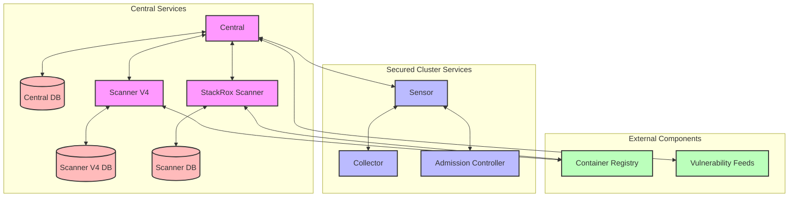

# Architecture

## Architecture Diagram

:::note

The diagram above illustrates the main components of RHACS and their relationships:

1. **Central Services** (Pink background)
   - Central: Core management service
   - Central DB: Data persistence
   - Scanner V4: Container image vulnerability scanner
   - StackRox Scanner: Default scanner
   - Related database components

2. **Secured Cluster Services** (Blue background)
   - Sensor: Component that communicates with Central
   - Collector: Collects container runtime information
   - Admission Controller: Enforces security policies

3. **External Components** (Green background)
   - Container Registry: Container image registry
   - Vulnerability Feeds: Vulnerability data sources

4. **Database Components** (Red background)
   - Central DB
   - Scanner V4 DB
   - Scanner DB

:::

## Red Hat Advanced Cluster Security for Kubernetes architecture

Red Hat Advanced Cluster Security for Kubernetes (RHACS) uses a distributed architecture that supports high-scale deployments and is optimized to minimize the impact on the underlying OpenShift Container Platform or Kubernetes nodes.

You install RHACS as a set of containers in your OpenShift Container Platform or Kubernetes cluster. RHACS includes the following services:

* Central services you install on one cluster
* Secured cluster services you install on each cluster you want to secure by RHACS

In addition to these primary services, RHACS also interacts with other external components to enhance your clusters' security.

### Installation differences

When you install RHACS on OpenShift Container Platform by using the Operator, RHACS installs a lightweight version of Scanner on every secured cluster. The lightweight Scanner enables the scanning of images in the integrated OpenShift image registry. When you install RHACS on OpenShift Container Platform or Kubernetes by using the Helm install method with the _default_ values, the lightweight version of Scanner is not installed. To install the lightweight Scanner on the secured cluster by using Helm, you must set the `scanner.disable=false` parameter. You cannot install the lightweight Scanner by using the `roxctl` installation method.

## Central services

You install Central services on a single cluster. These services include the following components:

* **Central**: Central is the RHACS application management interface and services. It handles API interactions and user interface (RHACS Portal) access. You can use the same Central instance to secure multiple OpenShift Container Platform or Kubernetes clusters.

* **Central DB**: Central DB is the database for RHACS and handles all data persistence. It is currently based on PostgreSQL 13.

* **Scanner V4**: Beginning with version 4.4, RHACS contains the Scanner V4 vulnerability scanner for scanning container images. Scanner V4 is built on ClairCore, which also powers the Clair scanner. Scanner V4 supports scanning of language and OS-specific image components. For version 4.4, you must use this scanner in conjunction with the StackRox Scanner to provide node and platform scanning capabilities until Scanner V4 support those capabilities. Scanner V4 contains the Indexer, Matcher, and DB components.

  * **Scanner V4 Indexer**: The Scanner V4 Indexer performs image indexing, previously known as image analysis. Given an image and registry credentials, the Indexer pulls the image from the registry. It finds the base operating system, if it exists, and looks for packages. It stores and outputs an index report, which contains the findings for the given image.

  * **Scanner V4 Matcher**: The Scanner V4 Matcher performs vulnerability matching. If the Central services Scanner V4 Indexer indexed the image, then the Matcher fetches the index report from the Indexer and matches the report with the vulnerabilities stored in the Scanner V4 database. If a Secured Cluster services Scanner V4 Indexer performed the indexing, then the Matcher uses the index report that was sent from that Indexer, and then matches against vulnerabilities. The Matcher also fetches vulnerability data and updates the Scanner V4 database with the latest vulnerability data. The Scanner V4 Matcher outputs a vulnerability report, which contains the final results of an image.

  * **Scanner V4 DB**: This database stores information for Scanner V4, including all vulnerability data and index reports. A persistent volume claim (PVC) is required for Scanner V4 DB on the cluster where Central is installed.

* **StackRox Scanner**: The StackRox Scanner is the default scanner in RHACS. Version 4.4 adds a new scanner, Scanner V4. The StackRox Scanner originates from a fork of the Clair v2 open source scanner. You must continue using this scanner for RHCOS node scanning and platform scanning.

* **Scanner-DB**: This database contains data for the StackRox Scanner.

RHACS scanners analyze each image layer to determine the base operating system and identify programming language packages and packages that were installed by the operating system package manager. They match the findings against known vulnerabilities from various vulnerability sources. In addition, the StackRox Scanner identifies vulnerabilities in the node's operating system and platform. These capabilities are planned for Scanner V4 in a future release.

### Vulnerability data sources

Sources for vulnerabilities depend on the scanner that is used in your system. RHACS contains two scanners: StackRox Scanner and Scanner V4. StackRox Scanner is the default scanner and is deprecated beginning with release 4.6. Scanner V4 was introduced in release 4.4 and is the recommended image scanner.

#### StackRox Scanner sources

StackRox Scanner uses the following vulnerability sources:

* Red Hat OVAL v2
* Alpine Security Database
* Data tracked in Amazon Linux Security Center
* Debian Security Tracker
* Ubuntu CVE Tracker
* NVD: This is used for various purposes such as filling in information gaps when vendors do not provide information. For example, Alpine does not provide a description, CVSS score, severity, or published date.

Note: This product uses the NVD API but is not endorsed or certified by the NVD.

* Linux manual entries and NVD manual entries: The upstream StackRox project maintains a set of vulnerabilities that might not be discovered due to data formatting from other sources or absence of data.
* repository-to-cpe.json: Maps RPM repositories to their related CPEs, which is required for matching vulnerabilities for RHEL-based images.

#### Scanner V4 sources

Scanner V4 uses the following vulnerability sources:

* Red Hat VEX: Used with release 4.6 and later. This source provides vulnerability data in Vulnerability Exploitability eXchange(VEX) format. RHACS takes advantage of VEX benefits to significantly decrease the time needed for the initial loading of vulnerability data, and the space needed to store vulnerability data.

* Red Hat CVE Map: This is used in addition with VEX data for images which appear in the Red Hat Container Catalog.

* OSV: This is used for language-related vulnerabilities, such as Go, Java, JavaScript, Python, and Ruby. This source might provide vulnerability IDs other than CVE IDs for vulnerabilities, such as a GitHub Security Advisory (GHSA) ID.

Note: RHACS uses the OSV database available at OSV.dev under Apache License 2.0.

* NVD: This is used for various purposes such as filling in information gaps when vendors do not provide information.

* Additional vulnerability sources:
  * Alpine Security Database
  * Data tracked in Amazon Linux Security Center
  * Debian Security Tracker
  * Oracle OVAL
  * Photon OVAL
  * SUSE OVAL

## Secured cluster services

You install Secured cluster services on each cluster that you want to secure by using RHACS. These services include the following components:

* **Sensor**: Sensor is the component that communicates with Central. It polls Central periodically for downloading updates for the sensor bundle configuration. It also sends events for the observed activity for the secured cluster and observed policy violations. Central communicates with Sensor to force reprocessing of all deployments against enabled policies.

* **Collector**: Collector is the component that collects information about the containers running in the cluster. It communicates with Sensor and sends all of the events to the respective Sensor for the cluster. On supported OpenShift Container Platform clusters, Collector analyzes the software packages installed on the nodes and sends them to Sensor so that Scanner can later scan them for vulnerabilities. Collector also requests missing drivers from Sensor. Sensor requests compliance scan results from Collector. Additionally, Sensor receives external Classless Inter-Domain Routing information from Central and pushes it to Collector.

* **Admission controller**: Admission controller is the component that enforces security policies at deployment time. Sensors send the list of security policies to enforce to Admission controller. Admission controller sends security policy violation alerts to Sensor. Admission controller can also request image scans from Sensor when required.

## RHACS connection protocols and default ports

Components of RHACS use various default ports and connection protocols. Depending on your system and firewall configuration, you might need to configure your firewall to allow traffic on certain ports.

The following table provides default ports and protocols for some connections within RHACS and between RHACS and external components:

| Component or external entity | Connection type | Port | Additional information |
|-----------------------------|-----------------|------|------------------------|
| Central and Scanner V4 Indexer | gRPC | 8443 | |
| Central and Sensor on secured cluster | TCP/HTTPS gRPC | 443 | Sensor and Central primarily communicate over a bidirectional gRPC stream, initiated by Sensor to Central's port 443. |
| Central and user (CLI) | gRPC HTTPS (with --force-http1 option) | 443 | For more information about the --force-http1 option, see the roxctl command options. |
| Central and vulnerability feeds | HTTPS | 443 | Connects to definitions.stackrox.io by default. |
| Collector to Sensor | gRPC | 443 | This is a bidirectional gRPC connection initiated by Collector to Sensor's port 443. |
| Collector (Compliance) to Sensor | gRPC | 8444 | If node scanning is enabled on OpenShift Container Platform release 4, this connection is initiated by Sensor to compliance running in the Collector pod. |
| Scanner to Scanner-DB | TCP | 5432 | |
| Scanner V4 Indexer to Central | HTTPS | 443 | |
| Scanner V4 Indexer and Matcher to Scanner V4 DB | TCP | 5432 | |
| Sensor and Admission Controller | gRPC | 443 | This is a bidirectional gRPC stream, initiated by Admission Controller to Sensor's port 443. This occurs in delegated scanning scenarios or in OpenShift Container Platform secured clusters. |