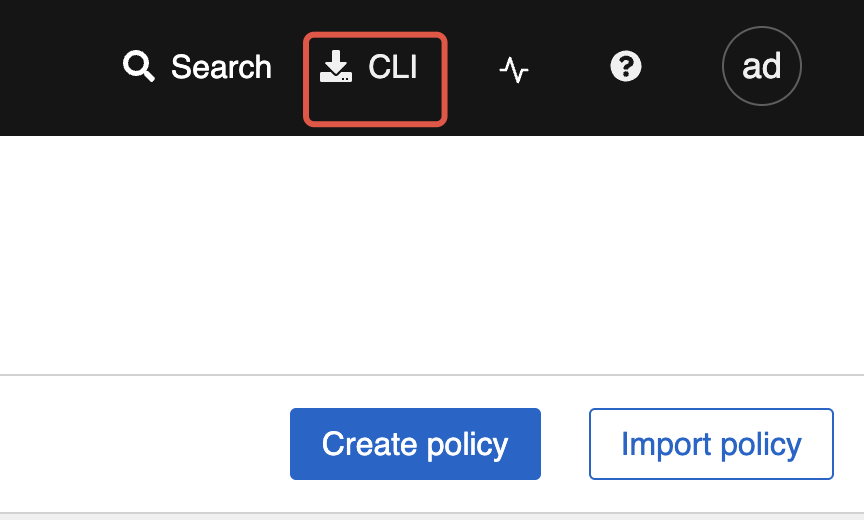

# Roxctl CLI 安装

本指南提供了安装、配置和使用 Alauda 容器安全的 `roxctl` 命令行界面（CLI）的说明。该 CLI 可用于 Linux、macOS、Windows，并且可以作为容器镜像使用。

---

## 概述

- **roxctl** 是一个用于管理和与 Alauda 容器安全交互的 CLI 工具。
- 支持的平台：**Linux**、**macOS**、**Windows**。
- 安装后，请验证 CLI 版本以确保正确设置。

---

## 安装

### 在 Linux 上安装

> 支持的架构：`amd64`、`arm64`、`ppc64le`、`s390x`

**操作步骤：**

1. 确定您的架构：
   ```bash
   arch="$(uname -m | sed 's/x86_64//')"; arch="${arch:+-$arch}"
   ```

2. 从 Portal 下载二进制文件：

   

3. 使其可执行：
   ```bash
   chmod +x roxctl
   ```

4. （可选）移动到您的 `PATH` 中的目录：
   ```bash
   echo $PATH
   # mv roxctl /usr/local/bin/
   ```

---

### 在 macOS 上安装

> 支持的架构：`amd64`、`arm64`

**操作步骤：**

1. 确定您的架构：
   ```bash
   arch="$(uname -m | sed 's/x86_64//')"; arch="${arch:+-$arch}"
   ```

2. 从 Portal 下载二进制文件：

   

3. 移除扩展属性：
   ```bash
   xattr -c roxctl
   ```

4. 使其可执行：
   ```bash
   chmod +x roxctl
   ```

5. （可选）移动到您的 `PATH` 中的目录：
   ```bash
   echo $PATH
   # mv roxctl /usr/local/bin/
   ```

---

### 在 Windows 上安装

> 支持的架构：`amd64`

**操作步骤：**

2. 从 Portal 下载二进制文件：

   
3. （可选）将包含 `roxctl.exe` 的目录添加到您的系统 `PATH`。
4. 验证安装：
   ```bash
   roxctl.exe version
   ```

---

## 验证

安装后，验证您的 `roxctl` 版本：

```bash
roxctl version
```

---

## 配置

### 设置环境变量

在使用 `roxctl` 之前，设置所需的环境变量：

```bash
export ROX_ENDPOINT=<central_host:port>
```

如果您使用 API 令牌进行身份验证：

```bash
export ROX_API_TOKEN=<api_token>
```

或者，您可以使用 `--token-file` 选项：

```bash
roxctl central debug dump --token-file <token_file>
```

**注意：**

- 不要同时使用 `--password` 和 `--token-file` 选项。
- 如果同时设置了 `ROX_API_TOKEN` 和 `--token-file`，CLI 将使用令牌文件。
- 如果同时设置了 `ROX_API_TOKEN` 和 `--password`，CLI 将使用密码。

---

### 身份验证方法

您可以使用 API 令牌、管理员密码（仅用于测试）或通过 `roxctl central login` 命令进行身份验证。

#### API 令牌

API 令牌推荐用于生产和自动化场景。它们提供特定的访问权限，有效期最长为一年。

**生成 API 令牌的步骤：**

1. 在 Alauda 容器安全门户中，转到 **平台配置 > 集成**。
2. 在 **身份验证令牌** 下，单击 **API 令牌**。
3. 单击 **生成令牌**。
4. 输入名称并选择具有所需访问权限的角色。
5. 单击 **生成** 并安全存储令牌。

**使用令牌的步骤：**

```bash
export ROX_API_TOKEN=<api_token>
```

---

## 使用 roxctl CLI

### 检查身份验证和用户信息

要查看您当前的身份验证状态和用户资料：

```bash
roxctl central whoami
```

**示例输出：**

```bash
UserID:        <redacted>
User name:     <redacted>
Roles:         Admin, Analyst, Continuous Integration, etc.
Access:        rw Access, rw Administration, rw Alert, ...
```

检查输出以确保您的身份验证和权限正确。
