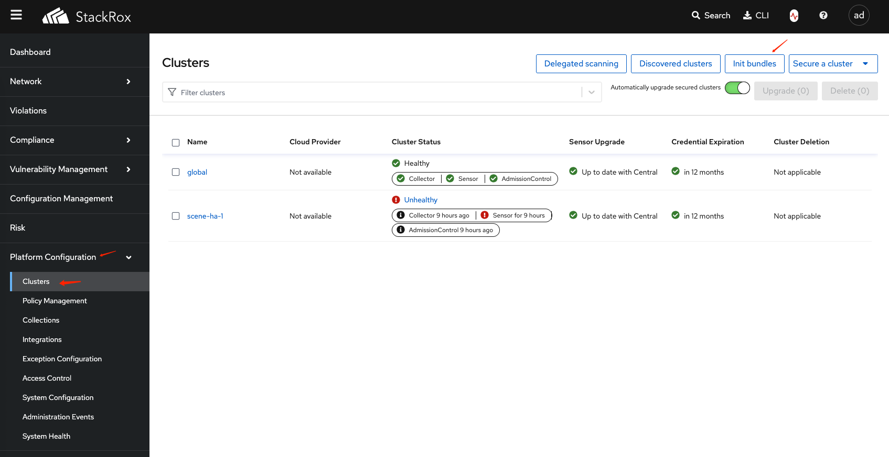
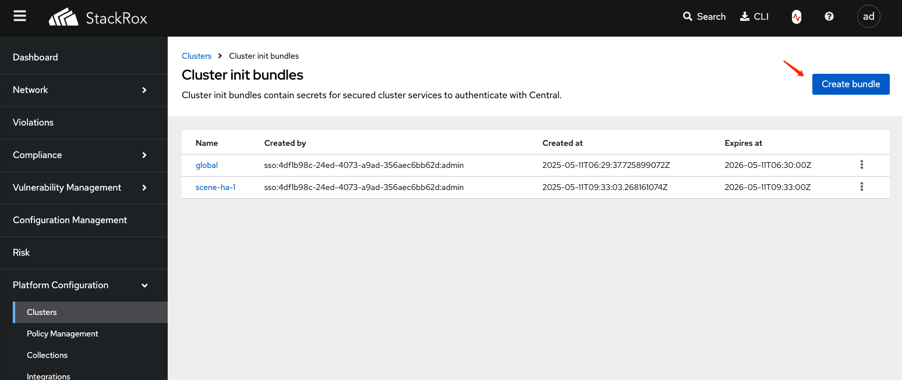
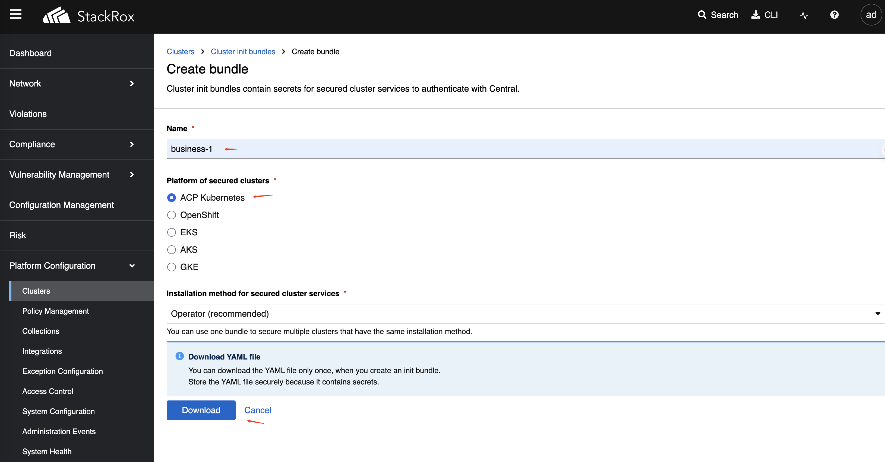

# Alauda 容器安全插件安装

本指南提供了安装 Alauda 容器安全插件的操作步骤。

## 安装要求

- 架构: `amd64`
- 内核版本: `>=5.8`
- 资源要求:
  - CPU: `>=4`
  - 内存: `>=8GB`
- PostgreSQL: `>=13`
- TLS 证书

## 中央服务插件安装

### 安装前步骤

1. 创建 stackrox 命名空间：

   ```bash
   kubectl create ns stackrox
   ```

2. 创建 central-db-password 密钥：\
   将密码存储在 `password` 数据项中。

   ```bash
   kubectl create secret generic central-db-password \
     --from-literal=password=<central db password> \
     -n stackrox
   ```

3. 启用 Ingress 并配置域名证书：\
   创建一个包含您的证书和密钥的 TLS 密钥。

   ```bash
   kubectl create secret tls central-ingress-tls \
     --cert=<path/to/tls.crt> \
     --key=<path/to/tls.key> \
     -n stackrox
   ```

4. 创建额外的 CA 密钥：

   ```bash
   kubectl create secret generic additional-ca \
     --from-file=00-ingress-ca.crt=<path-to-cert-file> \
     -n stackrox
   ```

---

### 通过 UI 安装

1. 在平台管理中，转到 **Marketplace → Cluster Plugins**。
2. 点击中央服务 StackRox 插件旁边的 **Install** 按钮。
3. 按提示填写存储类和配置参数。

| 参数                             | 描述                                                                                                                                               |
| -------------------------------- | -------------------------------------------------------------------------------------------------------------------------------------------------- |
| 中央数据库连接字符串            | 中央数据库的连接字符串。例如: `host=acid-business-1.proj01-postgres.svc port=5432 user=postgres sslmode=require`                                   |
| 主机                             | 为中央 Ingress 指定自定义主机名。在 stackrox 命名空间中指定一个名为 "central-ingress-tls" 的 ts 类型密钥，该密钥包含 tls.crt 和 tls.key。 |

---

### 通过 YAML 安装

将以下 YAML 应用到您的目标集群：

```yaml
# StackRox 集群插件的 YAML 部署方法
# 创建 StackRox 中央服务插件实例
---
apiVersion: cluster.alauda.io/v1alpha1
kind: ClusterPluginInstance
metadata:
  annotations:
    cpaas.io/display-name: stackrox-central-services
  labels:
    create-by: cluster-transformer
    manage-delete-by: cluster-transformer
    manage-update-by: cluster-transformer
  name: stackrox-central-services
spec:
  pluginName: stackrox-central-services
  config:
    env:
      offlineMode: true     # 是否以离线模式运行 StackRox。
    central:
      db:
        source:                    
          connectionString: "host=acid-business-1.proj01-postgres.svc port=5432 user=postgres sslmode=require" # 指定数据库连接字符串
      exposure:
        ingress:
          enabled: true
          host: "example.com"
        loadBalancer:
          enabled: false
```

---

### 访问中央控制台

- **地址:** `https://example.com` (中央 Ingress 主机的地址)
- **初始账户:** `admin/07Apples@`

---

## 集群服务插件安装

### 生成集群访问证书

1. 在平台配置中，转到 **Platform Configuration → Integrations**。

2. 点击 **Authentication Tokens --> Cluster Init Bundle** 按钮。

   

3. 点击 **Create bundle**。

   

4. 输入访问集群的名称并下载生成的文件（例如，`business-1-Operator-secrets-cluster-init-bundle.yaml`）。

   

---

### 集群安装前步骤

1. **创建 stackrox 命名空间：**

   ```bash
   kubectl create ns stackrox
   ```

2. **应用集群初始化包密钥：**

   ```bash
   kubectl apply -f business-1-Operator-secrets-cluster-init-bundle.yaml -n stackrox
   ```

3. 如果中央域使用不受信任的证书，您需要创建 additional-ca-sensor 密钥。
**配置 Ingress 域名证书：**

```bash
kubectl create secret generic additional-ca-sensor \
  --from-file=00-ingress-ca.crt=<path-to-cert-file> \
  -n stackrox
```

---

### 集群通过 UI 安装

1. 在平台管理中，转到 **Marketplace → Cluster Plugins**。
2. 点击集群服务 StackRox 插件旁边的 **Install** 按钮。
3. 按提示填写存储类和配置参数。

> **注意：** 中央服务地址是访问地址，例如 `wss://example.com:443`。

---

### 集群通过 YAML 安装

将以下 YAML 应用到您的目标集群：

```yaml
apiVersion: cluster.alauda.io/v1alpha1
kind: ClusterPluginInstance
metadata:
  annotations:
    cpaas.io/display-name: stackrox-secured-cluster-services
  labels:
    create-by: cluster-transformer
    manage-delete-by: cluster-transformer
    manage-update-by: cluster-transformer
  name: stackrox-secured-cluster-services
spec:
  pluginName: stackrox-secured-cluster-services
  config:
    centralEndpoint: "wss://example.com:443" # 指定 StackRox 中央服务的地址
```

---

## 插件卸载

卸载插件后，如果 `stackrox` 命名空间中仍然存在以下密钥资源，请手动清理：

| 密钥名称模式         | 描述                     |
| ------------------- | ----------------------- |
| central-\*          | 与中央相关的密钥         |
| scanner-\*          | 与扫描器相关的密钥       |
| sensor-tls          | 传感器 TLS 密钥         |
| service-ca          | 服务 CA 密钥            |
| admission-control-tls| 审批控制 TLS           |
| collector-tls       | 收集器 TLS 密钥         |
| stackrox-generated-once | 一次性生成的密钥     |
