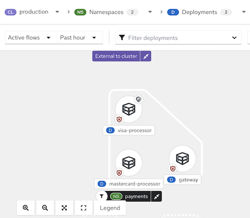

# 网络图

Alauda 容器安全中的网络图提供了对您环境中部署、网络流量和网络策略的高层次和详细见解。它帮助您可视化工作负载之间的通信，实时监控潜在的网络流量，并有效管理网络安全策略。

Alauda 容器安全分析每个受保护集群中的所有网络策略，显示哪些部署可以相互通信，哪些可以访问外部网络。它还跟踪正在运行的部署及其网络流量。网络图显示以下核心元素：

## 网络图中的实体

### 内部实体

内部实体表示部署与私有地址空间内的 IP 地址之间的连接，私有地址空间的定义见 [RFC 1918](https://datatracker.ietf.org/doc/html/rfc1918)。有关更多详细信息，请参见“涉及内部实体的连接”。

### 外部实体

外部实体表示部署与私有地址空间外的 IP 地址之间的连接，私有地址空间的定义见 [RFC 1918](https://datatracker.ietf.org/doc/html/rfc1918)。有关更多详细信息，请参见“网络图中的外部实体和连接”。

## 网络组件

您可以使用顶部菜单选择命名空间（**NS** 标签）和部署（**D** 标签），以在所选集群（**CL** 标签）上显示网络图。可以通过 CVE、标签或镜像使用下拉列表进一步过滤部署。

## 网络流量

网络图支持两种类型的流量可视化：

- **活动流量**：显示所选命名空间或部署的观察到的实时流量。您可以调整显示数据的时间段。
- **非活动流量**：显示网络策略允许的潜在流量，帮助您识别可能需要额外策略以实现更严格隔离的地方。

## 网络策略

您可以查看所选组件的现有策略或识别没有策略的组件。网络图还允许您模拟网络策略。有关更多信息，请参见“从网络图模拟网络策略”。

您可以与网络图交互，以查看有关项目的更多详细信息并执行操作，例如将网络流量添加到基线中。

**图 1 网络图示例**

## 使用网络图的提示

- 打开图例以了解命名空间、部署和连接所使用的符号。
- 使用显示选项下拉菜单显示或隐藏图标，例如网络策略状态徽章、活动外部流量徽章和边缘连接的端口/协议标签。
- Alauda 容器安全检测网络流量的变化，例如节点的加入或离开。当检测到变化时，会出现通知，显示可用更新的数量。单击通知以刷新图表。

当您单击图表中的项目时，侧边面板将显示可折叠部分，提供该项目的详细信息。您可以选择：

- 部署
- 命名空间
- 外部实体
- CIDR 块
- 外部组

侧边面板根据您的选择显示相关信息。项目名称旁边的 **D** 或 **NS** 标签（例如，“visa-processor”）指示它是部署还是命名空间。以下是部署的侧边面板示例：

**图 2 部署示例的侧边面板**

查看命名空间时，侧边面板包括搜索栏和部署列表。您可以单击部署以查看其信息。侧边面板还包括 **网络策略** 标签，您可以从中查看、复制或导出该命名空间中定义的任何网络策略。

**图 3 命名空间示例的侧边面板**

### 内部实体的场景

内部实体连接的常见场景包括：

- IP 地址的更改或接受连接的部署（服务器）的删除，而客户端仍然尝试访问它
- 部署与编排器 API 的通信
- 部署使用网络 CNI 插件（例如 Calico）进行通信
- 传感器的重启，导致 IP 地址与过去部署的映射重置（例如，当传感器无法识别过去实体的 IP 地址或现有实体的过去 IP 地址时）
- 涉及未由编排器管理的实体的连接（有时被视为*集群外*），但使用 RFC 1918 定义的私有地址空间中的 IP 地址

内部实体用图标表示。单击 **内部实体** 显示这些实体的流量。

## 在命名空间中查看部署详细信息

要查看命名空间中部署的详细信息：

1. 在 Alauda 容器安全门户中，转到 **网络图** 并从下拉列表中选择您的集群。
2. 单击 **命名空间** 列表，并使用搜索字段查找命名空间，或选择单个命名空间。
3. 单击 **部署** 列表，并使用搜索字段查找部署，或选择单个部署以在网络图中显示。
4. 在网络图中，单击部署以查看信息面板。
5. 单击 **详细信息**、**流量**、**基线** 或 **网络策略** 标签以查看相应的信息。

Kubernetes `NetworkPolicy` 资源使用标签选择 Pods，并定义规则以指定允许的流量。Alauda 容器安全发现并显示您所有 Kubernetes 集群、命名空间、部署和 Pods 的网络策略信息，均在网络图中展示。

## 查看网络策略

要查看网络策略：

1. 在 Alauda 容器安全门户中，转到 **网络图** 并从下拉列表中选择您的集群。
2. 单击 **命名空间** 列表并选择单个命名空间，或使用搜索字段查找命名空间。
3. 单击 **部署** 列表并选择单个部署，或使用搜索字段查找部署。
4. 在网络图中，单击部署以查看信息面板。
5. 在 **详细信息** 标签下的 **网络安全** 中，您可以查看有关网络策略规则的摘要消息，包括：
   - 网络中是否存在调节入站或出站流量的策略
   - 您的网络是否缺少策略，因此允许所有入站或出站流量
6. 要查看网络策略的 YAML 文件，请单击策略规则或 **网络策略** 标签。

## 管理 CIDR 块

您可以指定自定义 CIDR 块或配置网络图中自动发现的 CIDR 块的显示。

要管理 CIDR 块：

1. 在 Alauda 容器安全门户中，转到 **网络图**，然后选择 **管理 CIDR 块**。
2. 您可以：
   - 切换 **自动发现的 CIDR 块** 以隐藏网络图中的自动发现的 CIDR 块。
     > **注意：** 隐藏自动发现的 CIDR 块适用于所有集群，而不仅仅是网络图中所选的集群。
   - 添加自定义 CIDR 块：
     1. 在字段中输入 CIDR 名称和 CIDR 地址。要添加更多，请单击 **添加 CIDR 块** 并输入每个块的信息。
     2. 单击 **更新配置** 以保存更改。
